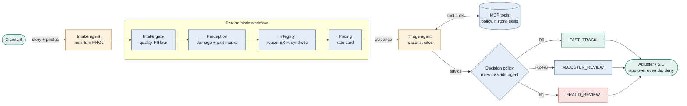
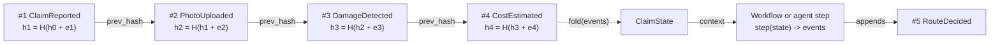
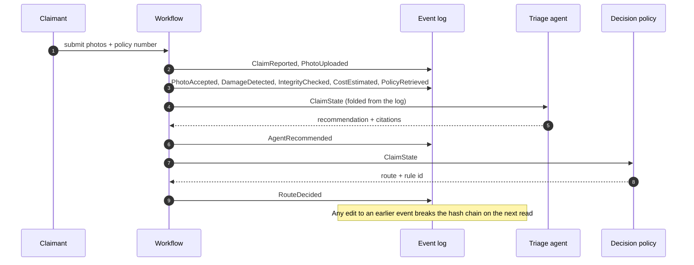
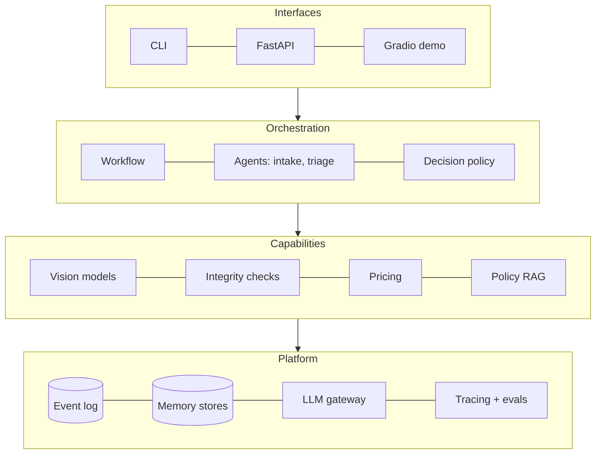
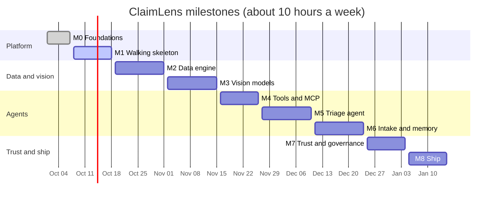

# ClaimLens

**AI-assisted vehicle damage claims triage.** Custom-trained computer-vision models act as tools
for an auditable adjuster agent that runs inside a deterministic workflow, with humans in control
of every consequential decision.

> Status: **M1 – Walking skeleton** (in progress). This repository started as a STAT 5350 course
> project (a YOLOv8 car-damage detector). See [`legacy/README.md`](legacy/README.md) for the
> original code and the audit that motivated the rebuild.

## Why

Filing a car-damage claim means an adjuster must inspect photos, identify damaged parts, check the
policy, estimate cost, watch for fraud, and route the claim. ClaimLens aims to **fast-track simple
claims in minutes with an explanation an auditor can verify, and escalate everything else to a
human with the evidence already assembled.**

## Design principles

1. **Models measure, the agent reasons, rules decide.** CV models produce measurable evidence;
   the LLM agent interprets it; deterministic business rules make the final routing decision.
2. **The system never auto-denies.** It can fast-track or escalate. Only humans deny claims.
3. **Everything is an event.** Claim state is an append-only, hash-chained event log that provides
   durability, memory, audit, and replay.
4. **Evals before features.** Every component ships with a measurable evaluation.

## How a claim moves

Fixed code handles every predictable step. The LLM is used only where judgment is needed, and its
advice passes through deterministic rules before any routing decision.



There is no route that denies a claim. Even a fast-tracked claim needs a human approval token
before payment.

## Every step is an event

Claim state is never stored directly. It is rebuilt by folding an append-only log in which each
event carries the hash of the one before it, so editing history is detectable and any claim can
pause for days and resume.





## System layers



## Roadmap at a glance



## Repository layout

```
src/claimlens/      Python package (domain code)
tests/              unit / integration tests and fixtures
training/           data and training pipelines (from M2)
evals/              golden claims, eval harness, reports (from M1)
docs/               PR/FAQ, ADRs, specs, cards, learning notes
data/               datasets — versioned with DVC, not git (see data/README.md)
models/             model weights — not in git (see models/README.md)
legacy/             the original course project, frozen for comparison
```

## Getting started

Requires [uv](https://docs.astral.sh/uv/).

```bash
uv sync                          # Python 3.12 environment with dev tools
uv run pre-commit install        # lint and format checks on every commit
uv run pytest                    # tests (no data, weights or API keys needed)

# Run a claim end to end with the legacy baseline model
uv sync --group vision           # adds Ultralytics (large download)
uv run claimlens run --policy P-1001 --description "Scraped a pole" tests/fixtures/images/dent_1.jpg
uv run claimlens show <claim-id>     # decision and audit trail
uv run claimlens verify <claim-id>   # check the hash chain
uv run claimlens resume <claim-id>   # finish a claim that was interrupted
```

## Use ClaimLens from Claude Code (MCP)

ClaimLens runs as four MCP tool servers (ADR 0010). Each one shows and accepts only the tools its
profile allows. Open this repository in [Claude Code](https://claude.com/claude-code): the
checked-in `.mcp.json` starts the vision, policy and claims servers with the read-only **`demo`**
profile, so approve them when asked. Then ask, for example:

- *"What damage is in `tests/fixtures/images/dent_1.jpg`, and which part is it on?"*
- *"Is policy P-1001 covered for collision, and what is the deductible?"*
- *"What does policy P-1001 say about a rental car after a collision? Quote the clause."* (run
  `uv sync --group knowledge && uv run claimlens knowledge build` once first)
- *"Add a note to claim <id> saying the photo is blurry."* The demo profile is read-only, so the
  server refuses with `ScopeDenied`.

Run a server yourself with `uv run claimlens mcp vision --profile demo` (stdio). For **Claude
Desktop**, add the same `command` and `args` from `.mcp.json` to its config, with `cwd` set to this
folder.

| Profile | Can use |
|---|---|
| `intake` | photo quality check, policy lookup |
| `triage` | all read tools, plus `add_note`, `assign_queue` |
| `demo` | all read tools (no writes) |
| `operator` (human, built-in) | `issue_payment`, only with a token from `claimlens approve-payment <claim> <amount>` |

Payments are deliberately not in `.mcp.json`. No agent profile can pay.

## Roadmap

| Milestone | Focus |
|---|---|
| M0 | Foundations: repo, tooling, CI, ADRs, legacy audit |
| M1 | Walking skeleton: event-sourced claim state, thin end-to-end pipeline, golden claims |
| M2 | Data engine: CarDD + foundation-model auto-labelling, DVC, FiftyOne |
| M3 | Vision models: damage + part instance segmentation, calibration, model card |
| M4 | Tools & integration: MCP servers, LLM gateway, policy RAG |
| M5 | Triage agent: human-in-the-loop, LLM evals, CI gates, tracing |
| M6 | Intake agent & memory: multi-turn intake, Agent Skills, user-simulator evals |
| M7 | Trust & governance: OWASP agentic threat model, red-team, fraud, PII, AIS program |
| M8 | Ship: ONNX, Docker, public demo, monitoring |

Full design: [`docs/specs/2026-10-01-claimlens-design.md`](docs/specs/2026-10-01-claimlens-design.md).

## License

Code: MIT (see [`LICENSE`](LICENSE)). Datasets keep their own licenses — see
[`data/README.md`](data/README.md).
