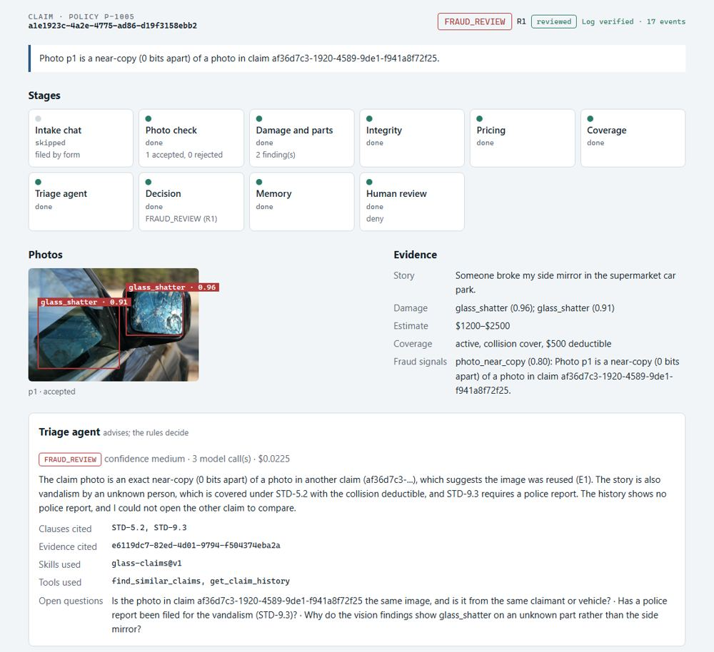
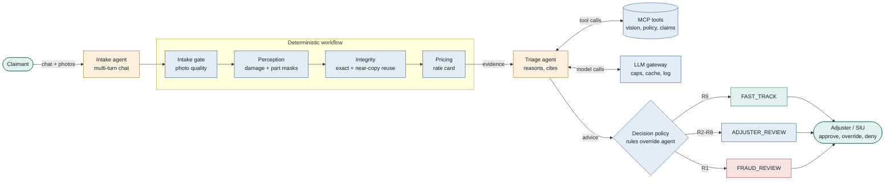
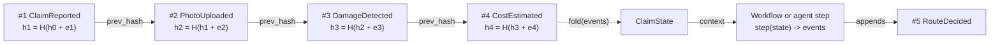
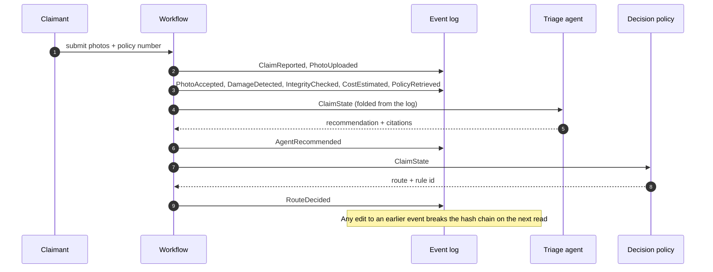
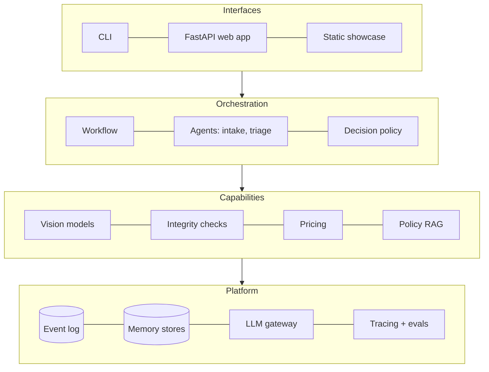
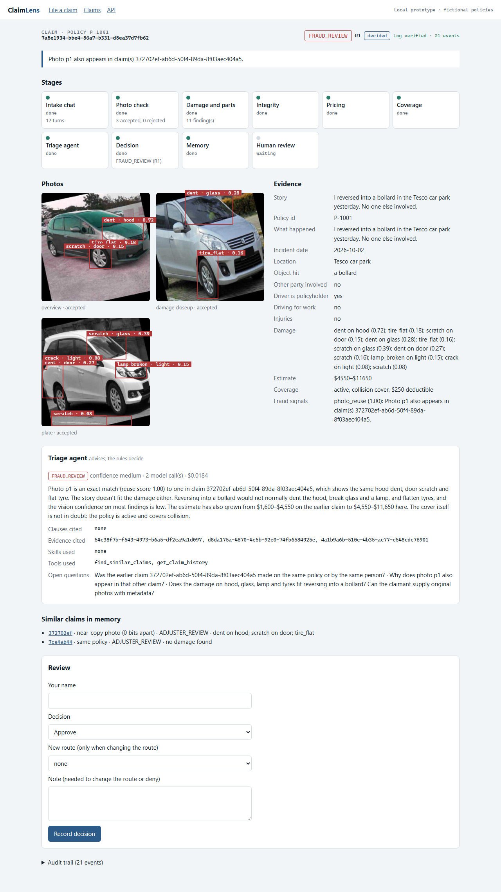

# ClaimLens

[](https://github.com/kb2326/claimlens/actions/workflows/ci.yml)
[](https://huggingface.co/spaces/kb2606/claimlens)


**AI-assisted vehicle damage claims triage.** Our own computer-vision models measure the damage, an
LLM agent reasons over the evidence and the policy wording, and fixed rules decide the route. A
person approves every payout, and only a person can deny a claim.

**See it:** [the live read-only showcase](https://huggingface.co/spaces/kb2606/claimlens) (five
sample claims and a recorded chat) · **Read:** [the story on Medium](https://medium.com/@karthickbalaje01/i-built-an-ai-system-for-insurance-claims-where-the-ai-isnt-allowed-to-deny-you-9188ecdada8e) ·
[system card](docs/system-card.md) · [model card](docs/model-card.md) ·
[design](docs/specs/2026-10-01-claimlens-design.md)

> **Status: complete (M0–M8).** Data engine, our own vision models, MCP tools, the LLM triage and
> intake agents with evaluations, memory and skills, a web app, a red-team suite, a system card,
> and a public showcase. It started as a STAT 5350 course project (a YOLOv8 car-damage detector);
> see [`legacy/README.md`](legacy/README.md) for the original and the audit that led to the rebuild.



*A showcase claim: a re-saved copy of another claim's photo, caught as a near-copy (rule R1),
explained by the agent and denied by a person. Photo: "2010-03-08 Shattered side mirror on BMW" by
Ildar Sagdejev (Specious), [CC BY-SA 4.0](https://creativecommons.org/licenses/by-sa/4.0),
via Wikimedia Commons.*

## Where it stands

| Area | What is built | Result |
|---|---|---|
| Claim pipeline | Event-sourced, resumable workflow; rules R1–R9; no route can deny | 850+ tests, 96% coverage |
| Data | `damage-v1` (4,000 CarDD images) and `parts-v1` (3,833 images), versioned with DVC | 0 contract errors; 33 near-duplicate images moved so no group spans two splits |
| Damage model | YOLO11s-seg, trained on a free Kaggle GPU | Test mask mAP50 **0.733** (course model: validation mAP50 0.137) |
| Part model | YOLO11n-seg, 22 part classes | Test mask mAP50 **0.746** |
| Fusion | Which part each damage is on, and its share of that part | 88% of golden findings get a part |
| Calibration | Temperature scaling; the confidence threshold comes from evidence | T = 0.80; threshold 0.65 |
| Golden set v1 (97 claims) | Full system with the rule-based agent, threshold 0.65 | Route accuracy **0.78**, escalation recall **1.00**, 9 of 30 correct fast-tracks |
| Tools (MCP) | 4 servers with per-agent scopes; payments need a human-signed, single-use token | Usable from Claude Code |
| Triage agent | LangGraph agent on the gateway and read-only MCP tools; cites clauses, checked in code | Escalation recall 1.00, $0.010 per claim, 0 failures |
| Agent evaluation | Golden v2 (150 claims, 53 story cases), code-scored quality, an LLM judge, a CI gate on a committed scorecard | Stories caught **43 of 43** with the right clause; escalation recall **1.00** |
| Intake agent | A chat that collects 10 facts and 3 photos, coaches retakes, pauses and resumes (LangGraph checkpoints) | Simulated customers: pass^4 **0.80** (target 0.70) |
| Memory and skills | Claim memory written by the workflow (near-copy photos, same policy, similar damage); 3 approved adjuster procedures | Harmless stories fast-tracked 5 of 10 (was 3); recall still 1.00 |
| Human review | Review queue; only a person can deny; payments wait for a person on review routes | `claimlens queue`, `claimlens review-claim` |
| LLM gateway | Tiers, retries, fallback, cache; caps of $0.10 per claim and $1 per day | Two live test calls cost $0.0006 in total |
| Web app | `claimlens serve`: chat, claims list, claim page, review (local only) | Live claim filed, decided and reviewed; log verified |
| Showcase | Read-only static export on Hugging Face, deployed by GitHub Actions | [Live](https://huggingface.co/spaces/kb2606/claimlens); no keys, weights or server |
| Red team | 34 attacks mapped to the OWASP agentic top 10, run with a model that obeys the attacker; live injections on the real agent | **33 of 33 run held** (+ dependency audit in CI); live: 15 of 15 to a person, agent fooled 0 times |
| Fraud | Exact and near-copy photo reuse across claims (memory) → fraud review | Re-saves and 2% crops caught |
| Policy search | 56 fictional clauses, LanceDB hybrid search, citation check | recall@5 **1.00** on 10 questions (a small corpus, so a generous bar) |

Escalation recall is the safety gate: every claim that needs a person must reach one. It has
stayed at 1.00 through every model change, and it caught a design mistake before it shipped (see
[`docs/retros/m3-vision-models.md`](docs/retros/m3-vision-models.md)).

More detail: [model card](docs/model-card.md) · [data card](docs/data-card.md) ·
[decision records](docs/adr/) · [roadmap](docs/roadmap.md) · [evaluation reports](evals/reports/).

## Why

Filing a car-damage claim means an adjuster must inspect photos, identify damaged parts, check the
policy, estimate cost, watch for fraud, and route the claim. ClaimLens aims to **fast-track simple
claims in minutes with an explanation an auditor can verify, and escalate everything else to a
human with the evidence already assembled.**

## Design principles

1. **Models measure, the agent reasons, rules decide.** CV models produce measurable evidence;
   the LLM agent interprets it; deterministic business rules make the final routing decision.
2. **The system never auto-denies.** It can fast-track or escalate. Only humans deny claims.
3. **Everything is an event.** Claim state is an append-only, hash-chained event log that provides
   durability, memory, audit, and replay.
4. **Evals before features.** Every component ships with a measurable evaluation.

## How a claim moves

Fixed code handles every predictable step. The LLM is used only where judgment is needed, and its
advice passes through deterministic rules before any routing decision. On the command line the LLM
triage agent runs with `--agent llm` (the default is the free rule-based stub); the web app uses it
by default.



There is no route that denies a claim. Even a fast-tracked claim needs a human approval token
before payment.

## Every step is an event

Claim state is never stored directly. It is rebuilt by folding an append-only log in which each
event carries the hash of the one before it, so editing history is detectable and any claim can
pause for days and resume.





## System layers



## Repository layout

```
src/claimlens/      Python package
  events/           append-only, hash-chained claim log and state fold
  data/             dataset pipeline: taxonomy, contract, dedupe, splits
  vision/           damage and part models (fusion.py joins them)
  training/         training runs, MLflow import, champion selection, calibration
  mcp/              MCP tool servers, profiles (scopes), guard, audit
  llm/              LLM gateway: tiers, retries, cache, cost caps, call log
  knowledge/        policy wording parser and LanceDB hybrid search
  intake_agent/     LangGraph intake chat: facts, photo coaching, sessions, terminal
  memory/           claim memory: records, LanceDB index, near-copy photos, writer
  agent/            LangGraph triage agent: chat model on the gateway, MCP tools adapter, checks
  evals/            golden sets, triage eval, agent metrics, LLM judge, scorecard and gate
  web/              web app: FastAPI app, pages, chat and review API, read-only showcase mode
config/             rules, rate card, taxonomy, training runs, agent profiles, LLM tiers
knowledge/policies/ fictional policy wordings (basic, standard, premium)
prompts/            versioned prompt files
tests/              unit and integration tests, fixtures
training/           Kaggle GPU jobs
evals/              golden claims, red-team attacks, evaluation reports
showcase/           recorded sample claims for the public showcase (CC BY / BY-SA photos)
hf-space/           the Hugging Face Space README
reviews/            label review decisions, versioned as data
docs/               PR/FAQ, specs, plans, ADRs 0001-0020, system card, data card, model card, retros
data/               datasets — versioned with DVC, not git (see data/README.md)
models/             model weights — private, not in git (see models/README.md)
legacy/             the original course project, frozen for comparison
```

## Getting started

Requires [uv](https://docs.astral.sh/uv/).

```bash
uv sync                          # Python 3.12 environment with dev tools
uv run pre-commit install        # lint and format checks on every commit
uv run pytest                    # tests (no data, weights or API keys needed)

# Search the policy wording (downloads a small embedding model once)
uv sync --group knowledge
uv run claimlens knowledge build
uv run claimlens knowledge search "is a rental car covered after a collision?" --policy P-1001

# Run a claim end to end (needs model weights, see below)
uv sync --group vision --group knowledge   # adds Ultralytics (large download)
uv run claimlens run --policy P-1001 --description "Scraped a pole" tests/fixtures/images/dent_1.jpg
uv run claimlens --agent llm run --policy P-1001 --description "Scraped a pole" tests/fixtures/images/dent_1.jpg   # with the LLM triage agent (needs ANTHROPIC_API_KEY)
uv run claimlens show <claim-id>     # decision and audit trail
uv run claimlens verify <claim-id>   # check the hash chain
uv run claimlens resume <claim-id>   # finish a claim that was interrupted

# Report a claim by chatting with the intake agent (needs ANTHROPIC_API_KEY)
uv run claimlens intake            # /photo <path> sends a photo, /quit pauses
uv run claimlens intake --list     # paused sessions
uv run claimlens intake --session <id>

# Claim memory (opt-in with --memory on run, resume, review-claim, eval-triage)
uv run claimlens --memory run --policy P-1001 tests/fixtures/images/dent_1.jpg
uv run claimlens memory rebuild | show <claim-id> | forget <claim-id>

# Simulated customers for the intake agent (about $4)
uv run claimlens eval-intake -k 4 --report evals/reports/intake.md --llm-daily-cap 10

# Human review: claims waiting for a person, and recording a decision
uv run claimlens queue
uv run claimlens review-claim <claim-id> --approve --reviewer "Your Name"
uv run claimlens review-claim <claim-id> --deny --reviewer "Your Name" --note "why"

# Evaluation: the CI gate (no key or weights needed), and a full agent run (about $1)
uv run claimlens eval-gate
uv run claimlens --agent llm --detector fused eval-triage --golden evals/golden/v2/claims.jsonl \
  --llm-daily-cap 18 --scorecard evals/scorecards/current.json --report evals/reports/run.md

# Red team: 34 attacks with a model that obeys the attacker (free), then live injections (~$0.20)
uv run claimlens eval-redteam --report evals/reports/redteam.md
uv run claimlens --agent llm eval-triage --golden evals/redteam/injections.jsonl \
  --report evals/reports/redteam-live.md
```

Set `CLAIMLENS_TRACING=1` (after `uv sync --group tracing`) to send each agent run to a local
Phoenix (`uvx arize-phoenix serve`) as a trace of model calls, tool calls and graph steps.

`claimlens run` takes `--detector legacy|yolo-seg|fused`. `fused` is the full system (damage
model + part model).

**Model weights are private.** The models are trained on CarDD, which allows non-commercial
research use and does not allow redistribution, so the weights are not in this repository
(ADR 0004, ADR 0008). The tests, the policy search and the MCP policy and claims tools work
without them.

**LLM calls** go through the gateway and need `ANTHROPIC_API_KEY` in a git-ignored `.env`. The
test suite never calls the API unless you set `CLAIMLENS_LIVE=1`.

## Run the web prototype

A local web app over the whole flow (ADR 0018). It runs on your machine only (`127.0.0.1`).

```bash
uv sync --group web --group agent --group knowledge --group vision
uv run claimlens serve --seed            # http://127.0.0.1:8000
uv run claimlens serve --stub-agent --no-memory --seed   # free: no LLM calls for triage
uv run claimlens serve --llm-daily-cap 5    # owner override of the daily LLM cap
```

| Screen | What you do |
|---|---|
| **File a claim** (`/`) | Chat with the intake agent and upload three photos; you get a claim reference |
| **Claims** (`/claims`) | Every claim with its status, route and rule; filters for "needs review" and "fraud review" |
| **Claim** (`/claims/<id>`) | Watch the stages finish, see the damage boxes on the photos, the evidence, the agent's reasoning and cited clauses, similar claims, the route and rule, and the verified audit log |
| **Review** (on the claim page) | Approve, ask for information, change the route or deny (only a person can deny) |



*A live claim filed through the chat (2026-10-03). The photos reused one from an earlier test
claim, so rule R1 sent it to fraud review and the agent explained why. Photos: Roboflow Universe
"car-seg" by Gianmarco Russo, CC BY 4.0.*

The API is documented at `http://127.0.0.1:8000/docs`. `--seed` files three sample claims; the
third reuses the first photo, so rule R1 sends it to fraud review. The chat uses Claude Haiku
(about $0.05 a claim) and the triage agent Claude Sonnet (about $0.01), within the gateway's caps.

## The public showcase

A read-only version of the web app, serving five sample claims recorded with the real models and
agents (ADR 0020). Nothing can be filed or changed; there are no live model or LLM calls, and no
weights or keys in the image. Photos: Wikimedia Commons, credited in
[`showcase/CREDITS.md`](showcase/CREDITS.md).

```bash
uv run claimlens serve --showcase --data showcase      # locally, http://127.0.0.1:8000
docker build -t claimlens-showcase . && docker run -p 7860:7860 claimlens-showcase
```

**Live:** [huggingface.co/spaces/kb2606/claimlens](https://huggingface.co/spaces/kb2606/claimlens),
a free static Space: the same pages rendered once (`claimlens.web.static_export`), since Hugging
Face charges for Docker Spaces. To publish: the repository secret `HF_TOKEN` (a Hugging Face write
token) and variable `HF_SPACE`, then run the **Deploy showcase to Hugging Face** workflow. To
rebuild the samples: `uv run python scripts/build_showcase.py` (about $0.15).

## Use ClaimLens from Claude Code (MCP)

ClaimLens runs as four MCP tool servers (ADR 0010). Each one shows and accepts only the tools its
profile allows. Open this repository in [Claude Code](https://claude.com/claude-code): the
checked-in `.mcp.json` starts the vision, policy and claims servers with the read-only **`demo`**
profile, so approve them when asked. Then ask, for example:

- *"What damage is in `tests/fixtures/images/dent_1.jpg`, and which part is it on?"*
- *"Is policy P-1001 covered for collision, and what is the deductible?"*
- *"What does policy P-1001 say about a rental car after a collision? Quote the clause."* (run
  `uv sync --group knowledge && uv run claimlens knowledge build` once first)
- *"Add a note to claim <id> saying the photo is blurry."* The demo profile is read-only, so the
  server refuses with `ScopeDenied`.

Run a server yourself with `uv run claimlens mcp vision --profile demo` (stdio). For **Claude
Desktop**, add the same `command` and `args` from `.mcp.json` to its config, with `cwd` set to this
folder.

| Profile | Can use |
|---|---|
| `intake` | photo quality check, policy lookup |
| `triage` | all read tools, plus `add_note`, `assign_queue` |
| `demo` | all read tools (no writes) |
| `operator` (human, built-in) | `issue_payment`, only with a token from `claimlens approve-payment <claim> <amount>` |

Payments are deliberately not in `.mcp.json`. No agent profile can pay.

## Roadmap

| Milestone | Focus |
|---|---|
| M0 ✅ | Foundations: repo, tooling, CI, ADRs, legacy audit |
| M1 ✅ | Walking skeleton: event-sourced claim state, thin end-to-end pipeline, golden claims |
| M2 ✅ | Data engine: CarDD + foundation-model auto-labelling, DVC, FiftyOne |
| M3 ✅ | Vision models: damage + part instance segmentation, fusion, calibration, model card |
| M4 ✅ | Tools & integration: MCP servers with scopes, LLM gateway, policy search with citations |
| M5 ✅ | Triage agent: LangGraph agent, human review queue, golden v2, LLM judge, CI eval gate, tracing |
| M6 ✅ | Intake agent & memory: multi-turn intake, Agent Skills, user-simulator evals |
| M8a ✅ | Local web prototype: FastAPI, chat, claim page, review queue |
| M7 ✅ | Trust: red-team suite (OWASP agentic top 10), near-copy photos as a fraud rule, system card |
| M8b ✅ | Ship: read-only showcase (Docker, Hugging Face Spaces), write-up |

Each milestone followed the same loop: a design spec, a task-by-task plan, test-first
implementation, an independent review of the whole branch, a pull request with green CI, and a
retrospective ([`docs/retros/`](docs/retros/)). Releases are tagged (`v1.0.0` marks the finished
project). Full design: [`docs/specs/2026-10-01-claimlens-design.md`](docs/specs/2026-10-01-claimlens-design.md).

## License

Code: MIT (see [`LICENSE`](LICENSE)). Datasets keep their own licences (see
[`data/README.md`](data/README.md)); the damage model's training data (CarDD) allows
non-commercial research only, so its weights are not published. Showcase photos are from
Wikimedia Commons under CC BY / CC BY-SA, credited in [`showcase/CREDITS.md`](showcase/CREDITS.md).
Policies, insurers and claims are fictional.
