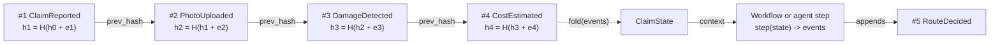
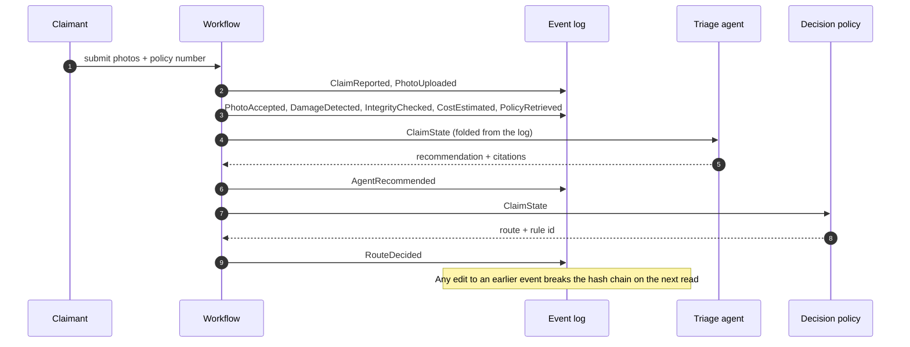
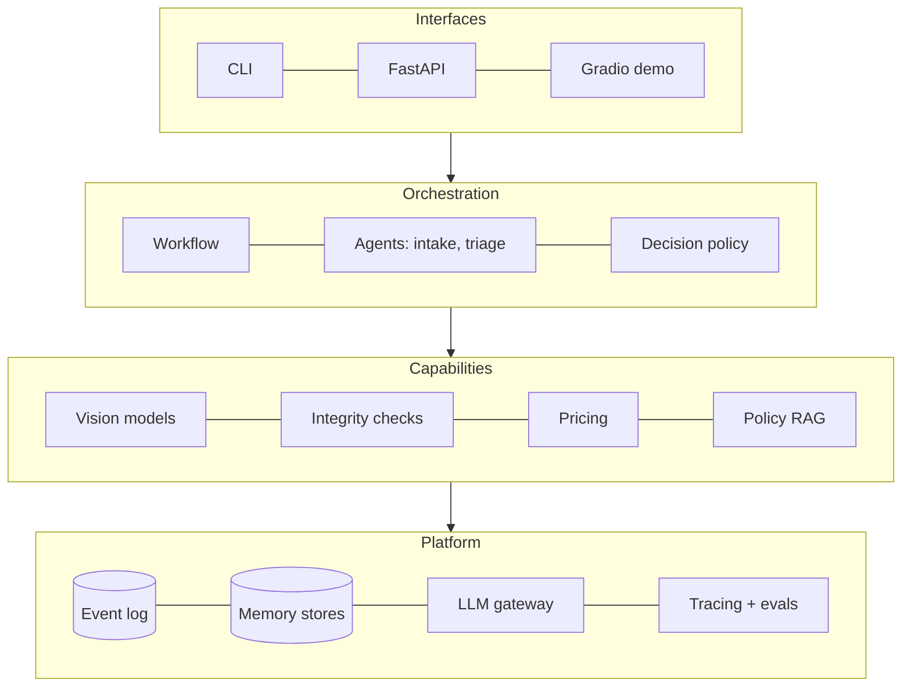
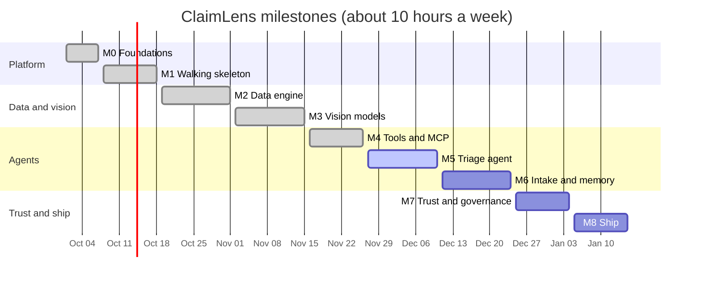

# ClaimLens

**AI-assisted vehicle damage claims triage.** Custom-trained computer-vision models act as tools
for an auditable adjuster agent that runs inside a deterministic workflow, with humans in control
of every consequential decision.

> Status: **M0–M4 complete; M5a built** (the LLM triage agent on LangGraph). Next: **M5b,
> measuring the agent** (150 golden claims, an LLM judge, CI gates, tracing, review queue). This repository started as a STAT 5350 course project (a
> YOLOv8 car-damage detector). See [`legacy/README.md`](legacy/README.md) for the original code and
> the audit that motivated the rebuild.

## Where it stands

| Area | What is built | Result |
|---|---|---|
| Claim pipeline | Event-sourced, resumable workflow; rules R1–R9; no route can deny | 410 tests, 96% coverage |
| Data | `damage-v1` (4,000 CarDD images) and `parts-v1` (3,833 images), versioned with DVC | 0 contract errors; 33 near-duplicate images moved so no group spans two splits |
| Damage model | YOLO11s-seg, trained on a free Kaggle GPU | Test mask mAP50 **0.733** (course model: validation mAP50 0.137) |
| Part model | YOLO11n-seg, 22 part classes | Test mask mAP50 **0.746** |
| Fusion | Which part each damage is on, and its share of that part | 88% of golden findings get a part |
| Calibration | Temperature scaling; the confidence threshold comes from evidence | T = 0.80; threshold 0.65 |
| Golden set (97 claims) | Full system at threshold 0.65 | Route accuracy **0.78**, escalation recall **1.00**, 9 of 30 correct fast-tracks |
| Tools (MCP) | 4 servers with per-agent scopes; payments need a human-signed, single-use token | Usable from Claude Code |
| Triage agent | LangGraph agent on the gateway and read-only MCP tools; cites clauses, checked in code | Escalation recall 1.00, $0.009 per claim, 0 failures |
| LLM gateway | Tiers, retries, fallback, cache; caps of $0.03 per claim and $1 per day | Two live test calls cost $0.0006 in total |
| Policy search | 56 fictional clauses, LanceDB hybrid search, citation check | recall@5 **1.00** on 10 questions (a small corpus, so a generous bar) |

Escalation recall is the safety gate: every claim that needs a person must reach one. It has
stayed at 1.00 through every model change, and it caught a design mistake before it shipped (see
[`docs/retros/m3-vision-models.md`](docs/retros/m3-vision-models.md)).

More detail: [model card](docs/model-card.md) · [data card](docs/data-card.md) ·
[decision records](docs/adr/) · [roadmap](docs/roadmap.md) · [evaluation reports](evals/reports/).

## Why

Filing a car-damage claim means an adjuster must inspect photos, identify damaged parts, check the
policy, estimate cost, watch for fraud, and route the claim. ClaimLens aims to **fast-track simple
claims in minutes with an explanation an auditor can verify, and escalate everything else to a
human with the evidence already assembled.**

## Design principles

1. **Models measure, the agent reasons, rules decide.** CV models produce measurable evidence;
   the LLM agent interprets it; deterministic business rules make the final routing decision.
2. **The system never auto-denies.** It can fast-track or escalate. Only humans deny claims.
3. **Everything is an event.** Claim state is an append-only, hash-chained event log that provides
   durability, memory, audit, and replay.
4. **Evals before features.** Every component ships with a measurable evaluation.

## How a claim moves

Fixed code handles every predictable step. The LLM is used only where judgment is needed, and its
advice passes through deterministic rules before any routing decision. The diagram shows the target
design. The LLM triage agent runs with `--agent llm` (the default stays the rule-based stub), and the intake
agent, PII blur, EXIF and synthetic-image checks are planned for M6 and M7.


There is no route that denies a claim. Even a fast-tracked claim needs a human approval token
before payment.

## Every step is an event

Claim state is never stored directly. It is rebuilt by folding an append-only log in which each
event carries the hash of the one before it, so editing history is detectable and any claim can
pause for days and resume.





## System layers



## Roadmap at a glance



The chart shows the planned dates. M0 to M4 were finished ahead of them.

## Repository layout

```
src/claimlens/      Python package
  events/           append-only, hash-chained claim log and state fold
  data/             dataset pipeline: taxonomy, contract, dedupe, splits
  vision/           damage and part models (fusion.py joins them)
  training/         training runs, MLflow import, champion selection, calibration
  mcp/              MCP tool servers, profiles (scopes), guard, audit
  llm/              LLM gateway: tiers, retries, cache, cost caps, call log
  knowledge/        policy wording parser and LanceDB hybrid search
config/             rules, rate card, taxonomy, training runs, agent profiles, LLM tiers
knowledge/policies/ fictional policy wordings (basic, standard, premium)
prompts/            versioned prompt files
tests/              unit and integration tests, fixtures
training/           Kaggle GPU jobs
evals/              golden claims, policy-search questions, evaluation reports
reviews/            label review decisions, versioned as data
docs/               PR/FAQ, specs, plans, ADRs 0001-0012, data card, model card, retros
data/               datasets — versioned with DVC, not git (see data/README.md)
models/             model weights — private, not in git (see models/README.md)
legacy/             the original course project, frozen for comparison
```

## Getting started

Requires [uv](https://docs.astral.sh/uv/).

```bash
uv sync                          # Python 3.12 environment with dev tools
uv run pre-commit install        # lint and format checks on every commit
uv run pytest                    # tests (no data, weights or API keys needed)

# Search the policy wording (downloads a small embedding model once)
uv sync --group knowledge
uv run claimlens knowledge build
uv run claimlens knowledge search "is a rental car covered after a collision?" --policy P-1001

# Run a claim end to end (needs model weights, see below)
uv sync --group vision --group knowledge   # adds Ultralytics (large download)
uv run claimlens run --policy P-1001 --description "Scraped a pole" tests/fixtures/images/dent_1.jpg
uv run claimlens --agent llm run --policy P-1001 --description "Scraped a pole" tests/fixtures/images/dent_1.jpg   # with the LLM triage agent (needs ANTHROPIC_API_KEY)
uv run claimlens show <claim-id>     # decision and audit trail
uv run claimlens verify <claim-id>   # check the hash chain
uv run claimlens resume <claim-id>   # finish a claim that was interrupted
```

`claimlens run` takes `--detector legacy|yolo-seg|fused`. `fused` is the full system (damage
model + part model).

**Model weights are private.** The models are trained on CarDD, which allows non-commercial
research use and does not allow redistribution, so the weights are not in this repository
(ADR 0004, ADR 0008). The tests, the policy search and the MCP policy and claims tools work
without them.

**LLM calls** go through the gateway and need `ANTHROPIC_API_KEY` in a git-ignored `.env`. The
test suite never calls the API unless you set `CLAIMLENS_LIVE=1`.

## Use ClaimLens from Claude Code (MCP)

ClaimLens runs as four MCP tool servers (ADR 0010). Each one shows and accepts only the tools its
profile allows. Open this repository in [Claude Code](https://claude.com/claude-code): the
checked-in `.mcp.json` starts the vision, policy and claims servers with the read-only **`demo`**
profile, so approve them when asked. Then ask, for example:

- *"What damage is in `tests/fixtures/images/dent_1.jpg`, and which part is it on?"*
- *"Is policy P-1001 covered for collision, and what is the deductible?"*
- *"What does policy P-1001 say about a rental car after a collision? Quote the clause."* (run
  `uv sync --group knowledge && uv run claimlens knowledge build` once first)
- *"Add a note to claim <id> saying the photo is blurry."* The demo profile is read-only, so the
  server refuses with `ScopeDenied`.

Run a server yourself with `uv run claimlens mcp vision --profile demo` (stdio). For **Claude
Desktop**, add the same `command` and `args` from `.mcp.json` to its config, with `cwd` set to this
folder.

| Profile | Can use |
|---|---|
| `intake` | photo quality check, policy lookup |
| `triage` | all read tools, plus `add_note`, `assign_queue` |
| `demo` | all read tools (no writes) |
| `operator` (human, built-in) | `issue_payment`, only with a token from `claimlens approve-payment <claim> <amount>` |

Payments are deliberately not in `.mcp.json`. No agent profile can pay.

## Roadmap

| Milestone | Focus |
|---|---|
| M0 ✅ | Foundations: repo, tooling, CI, ADRs, legacy audit |
| M1 ✅ | Walking skeleton: event-sourced claim state, thin end-to-end pipeline, golden claims |
| M2 ✅ | Data engine: CarDD + foundation-model auto-labelling, DVC, FiftyOne |
| M3 ✅ | Vision models: damage + part instance segmentation, fusion, calibration, model card |
| M4 ✅ | Tools & integration: MCP servers with scopes, LLM gateway, policy search with citations |
| M5 (in progress) | Triage agent ✅ (M5a); human-in-the-loop, LLM evals, CI gates, tracing (M5b) |
| M6 | Intake agent & memory: multi-turn intake, Agent Skills, user-simulator evals |
| M7 | Trust & governance: OWASP agentic threat model, red-team, fraud, PII, AIS program |
| M8 | Ship: ONNX, Docker, public demo, monitoring |

Full design: [`docs/specs/2026-10-01-claimlens-design.md`](docs/specs/2026-10-01-claimlens-design.md).

## License

Code: MIT (see [`LICENSE`](LICENSE)). Datasets keep their own licenses — see
[`data/README.md`](data/README.md).
